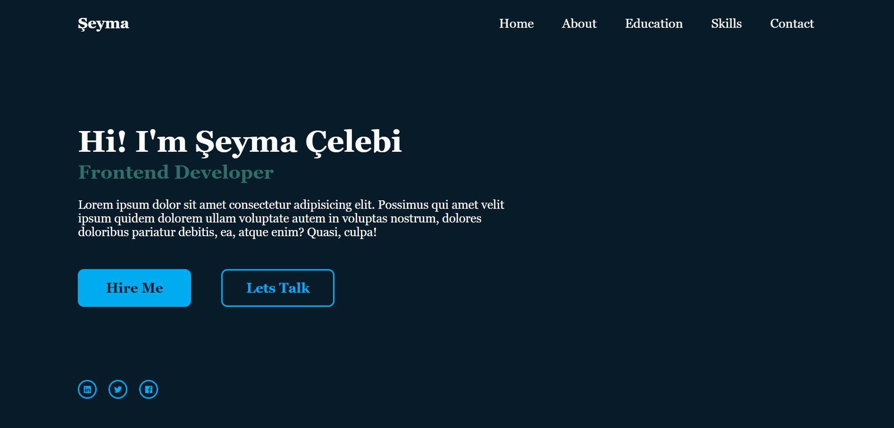

## My Personal Website
## Table of contents
* [General info](#general-info)
* [Technologies](#technologies)
* [Pictures](#pictures)
## General info
Welcome to my personal website! This project is built using HTML, CSS, and JavaScript. It’s designed to showcase my skills, projects, and interests.
Features
Responsive Design: The site is optimized for all devices, ensuring a seamless experience whether you're on a desktop, tablet, or smartphone.
Interactive Elements: JavaScript is used to create dynamic and engaging user interactions.
Clean and Modern UI: The design focuses on simplicity and user experience, with a clean layout and intuitive navigation.
Technologies Used
HTML5: For structuring the content and providing semantic meaning.
CSS3: For styling the website with custom layouts, animations, and responsiveness.
JavaScript: For adding interactivity and dynamic content to the site.

## Technologies
Project is created with:
*  Html
*  Css
*  Javascript

## Pictures
*
